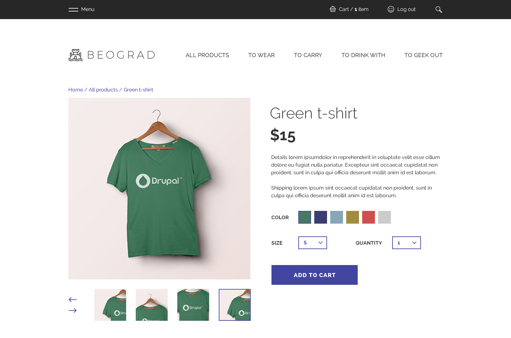

# Drupal Commerce Demo

Use [Composer](https://getcomposer.org/) to get a Drupal Commerce demo.



## Usage

First you need to [install composer](https://getcomposer.org/doc/00-intro.md#installation-linux-unix-osx).

> Note: The instructions below refer to the [global composer installation](https://getcomposer.org/doc/00-intro.md#globally).
You might need to replace `composer` with `php composer.phar` (or similar)
for your setup.

After that you can create the project:

```
composer create-project drupalcommerce/demo-project demo-commerce --stability dev --no-interaction
```

The `composer create-project` command passes ownership of all files to the
project that is created. You should create a new git repository, and commit
all files not excluded by the .gitignore file.

## What does the demo do?

* Drupal is installed in the `web` directory.
* Modules (packages of type `drupal-module`) are placed in `web/modules/contrib/`
* Theme (packages of type `drupal-theme`) are placed in `web/themes/contrib/`
* Profiles (packages of type `drupal-profile`) are placed in `web/profiles/contrib/`
* Creates default writable versions of `settings.php` and `services.yml`.
* Creates the `web/sites/default/files` directory.
* Latest version of DrupalConsole is installed locally for use at `bin/drupal`.
